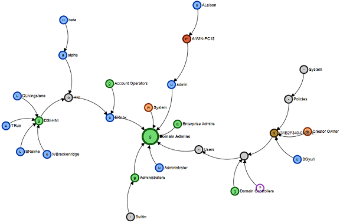
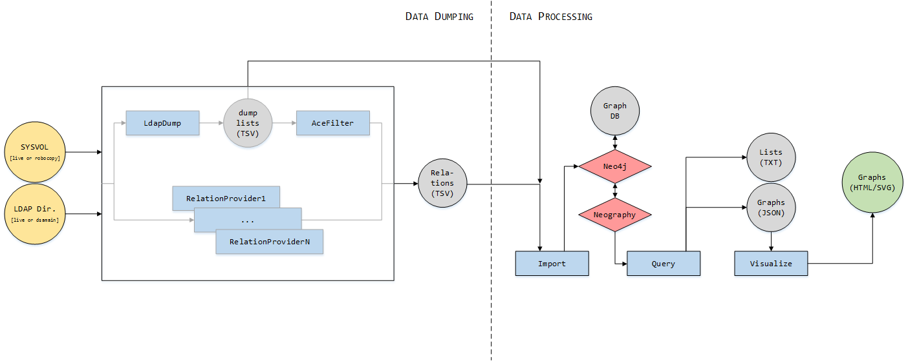

# Active Directory Control Paths

## "Who Can Read the CEO's Emails Edition"


Control paths in Active Directory are an aggregation of "control relations" between entities of the domain (users, computers, groups, GPO, containers, etc.)
which can be visualized as graphs (such as above) and whose purpose is to answer questions like *"Who can get 'Domain Admins' privileges ?"* or *"What resources can a user control ?"* and even *"Who can read the CEO's emails ?"*.

---
## CHANGES
New workflow for all steps, automating neo4j setup and import.

Basic Cypher querying through Neo4j REST API, increasing performance

New control paths are added : Kerberos delegation, SCCM dumping utilities for local admins and sessions control paths

Adding EXCHANGE permissions in v1.3 "Who Can Read the CEO's Emails Edition".
Permissions extracted from AD Users, Mailbox/DB descriptors, RBAC and MAPI folders.

Better resume features, nodes clustering (through OVALI) in v1.2.3.

New control paths are added in v1.2.2: RoDC and LAPS.

Major code changes take place in v1.2, as it is now able to dump and analyze very large Active Directories without hogging too much RAM.
Some very large ADs with over 1M objects and 150M ACEs have been processed in a reasonable amount of time (a few hours on a laptop, consuming less than 1GB RAM).

A few false positives were fixed and new control paths were added, so running it again on already tested ADs might be a good idea.

---
## QUICK START
- Download and extract the latest binary release from the Github Releases tab on a Windows machine.
- Skip to part 3 (Dump step)

---
## TABLE OF CONTENT
1. Install / Prerequisites
2. Usage context
3. Dump data into CSV files
4. Import CSV files in graph database
5. Query graph database
6. Visualize graphs
7. Other Querying Examples
8. Authors

## 1. INSTALL / PREREQUISITES

### Note

- **Dump** step runs on Windows only (tested on Windows 7 and later).
- **Import**, **Query** and **Visualize** steps can run on the same machine or on anything supporting Java and Neo4J. They have been tested on Windows and Linux.

### Building

 - Follow the instructions in BUILDING.md.

### Prerequisites

0. Download Zulu JDK 8 (https://cdn.azul.com/zulu/bin/zulu8.36.0.1-ca-jdk8.0.202-win_x64.zip) and put the zip in `Dump/ADCP`

0. Download Neo4j 3.4.1 (https://neo4j.com/artifact.php?name=neo4j-community-3.5.3-windows.zip) and put the zip in `Dump/ADCP`

0. Install EWS Managed API (if dumping Exchange permissions) from https://go.microsoft.com/fwlink/?LinkId=255472

## 2. USAGE CONTEXT

**Note:** None of these tools need to run on a domain controller.

Generating control paths graphs for your domain takes the 4 following steps:

0. **Dump** data from LDAP directory, SYSVOL and EWS.
0. **Prepare**  run analyzers to form control relationships.
0. **Import** these relations into a graph-oriented database (Neo4j).
0. **Query** that database to export various nodes lists, control paths, or **create JSON files** representing control paths graphs.
0. **Visualize** graphs created from those JSON files.



The 3 last steps are always performed in the same way, but the first step (data dumping) can be carried out in different contexts:

0. Live access to the domain, using a simple domain user account.
0. Live access to the domain, using a domain administrator account.
0. Offline, using a copy of a `ntds.dit` file and a robocopy of the SYSVOL preserving security attributes.

A simple domain user account is enough to dump a large majority of the control relations, but access to a few LDAP containers and GPO folders on the SYSVOL can be denied.
If one is available, an administrator account can thus be used to ensure that no element is inaccessible.

If no access to the domain is given, control graphs can be realized from offline copies of the `ntds.dit` and SYSVOL:

0. A copied `ntds.dit` file can be re-mounted to expose its directory through LDAP with the `dsamain` utility (available on a Windows server machine having the AD-DS or AD-LDS role, or with the "Active Directory Domain Services Tools" installed):

        dsamain.exe -allowNonAdminAccess -dbpath <ntds.dit path> -ldapPort 1234

0. A robocopy of the SYSVOL share preserving security attributes can be done with the `robocopy` utility (the destination folder must be on an NTFS volume):

        robocopy.exe \\<DC ip or host>\sysvol\<domain dns name>\Policies <destination path> /W:1 /R:1 /COPY:DATSO /E /TEE /LOG:<logfile.log>

    **Note**: to preserve security attributes on the copied files you need the `SeRestorePrivilege` on the local computer you're running the robocopy on (that is, you need to run these commands as local administrator).
    You then need to use the `SeBackupPrivilege` to process this local robocopy (dumping tools have a `use backup privilege` option that you must use).

## 3. DUMP DATA INTO CSV FILES

Use the powershell module in `Dump`. You must be in the `Dump` folder (important).
The simplest example is:

    Import-Module .\ADCP
    Get-ADCPDump
        -outputDir        <output directory>
        -domainController <DC ip or host>
        -domainDnsName    <domain FQDN>

Or with Exchange-related data:

    Import-Module .\ADCP
    $creds = Get-Credential
    Get-ADCPDump
        -outputDir          <output directory>
        -domainController   <DC ip or host>
        -domainDnsName      <domain FQDN>
        -exchangeServer     <exchange host>
        -exchangeCredential $creds

- `-domainController` can be an real domain controller, or a machine exposing the LDAP directory from a re-mounted `ntds.dit` using `dsamain`.

This produces some `.csv` and `.log` files as follow:

    <outputDir>
        |- yyyymmdd_domainfqdn\Logs\*.log                                    # Log files
        |- yyyymmdd_domainfqdn\Ldap\*.csv                                    # Unfiltered dumped information
        \- yyyymmdd_domainfqdn\Relations\*.csv                               # "Control relations" files, which will be imported into the graph database
        

### Other options

- `-Credential` : use explicit authentication (by default implicit authentication is used). `Credential` is a Powershell credential object, use `Get-Credential` to built it .
    If you don't want your password to appear in the command line but still use explicit authentication use the following `runas` command, then use the module without `-Credential` option:

        C:\> runas /netonly /user:DOM\username powershell.exe
- `-sysvolPath` can be a network path (example `\\192.168.25.123\sysvol\domain.local\Policies`) or a path to a local robocopy of this folder. Defaults to `\\domainController\sysvol\domainDnsName\Policies`.
- `-exchangeServer`, `-ExchangeCredential`: explicit authentication for EWS on a CAS Exchange server. 
  Use an Exchange Trusted Subsystem member account with an active mailbox, but NOT DA/EA/Org Mgmgt because of some Deny ACEs.
  
- `-logLevel`: change log and output verbosity (possible values are `ALL`, `DBG`, `INFO` (default), `WARN`, `ERR`, `SUCC` and `NONE`).
- `-ldapOnly` and `-sysvolOnly`: dump only data from the LDAP directory (respectively from the SYSVOL).
- `-ldapPort`: change ldap port (default is `389`). This can be useful for a copied `ntds.dit` re-mounted with `dsamain` since it allows you to use a non standard ldap port.
- `-useBackupPriv`: use backup privilege to access `-sysvolPath`, which is needed when using a robocopy. You must use an administrator account to use this option.
- `-forceOverwrite`: overwrite any previous dump files from the same-day, same-target folder

**Warning:** Accessing the Sysvol share from a non-domain machine can be blocked by UNC Paths hardening, which is a client-side parameter enabled by default since Windows 10. Disable it like this:
Set-ItemProperty -Path HKLM:\Software\Policies\Microsoft\Windows\NetworkProvider\HardenedPaths -Name "\\*\SYSVOL" -Value "RequireMutualAuthentication=0"

** Note:** The only binary needed in this step is `DirectoryCrawler.exe`.

## 4. PREPARE THE DATA
This action can be performed offline.

To computer relations, use the ADCP module (like in 3.)

    Import-Module .\ADCP
    Prepare-ADCPDump
        -inputDir         <input directory>
        -domainDnsName    <domain FQDN>


## 5. IMPORT CSV FILES INTO A GRAPH DATABASE

You can now import the Relations CSV files along with the AD objects into your Neo4j graph database. This step can be done fully offline. Use the ADCP module:

    Import-Module .\ADCP
    $instance = Import-ADCPDump
        -inputDir         <input directory>
        -domainDnsName    <domain FQDN>
    # Launch Neo4J
    $instance | Start-ADCPInstance

To perform these step manually (or in Linux):
0. Stop the Neo4j server if it is started:
```
    .\bin\neo4j stop
```
0. Import CSV files in a new graph database adcp.db:

- Set an environment variable to the dump folder for convenience:
```
    $env:DUMP = "PATH_TO\yyyymmdd_domainfqdn\" 
```
- In neo4j folder (you can copy/paste this):
```
    .\bin\neo4j-import --into data/databases/adcp.db --id-type string  `
    --nodes $env:DUMP\Ldap\all_nodes.csv  `
    --relationships $((dir $env:DUMP\relations\*.csv -exclude *.deny.csv) -join ',') `
    --input-encoding UTF-16LE --multiline-fields=true --legacy-style-quoting=false
```

Headers-related errors will be raised and can be ignored. It is still a good idea to have a look at the bad.log file.

0. Restart the Neo4j server if it is stopped:
```
    .\bin\neo4j start
````


**Note:** All the previous steps (2, 3, 4) can be piped in Powershell:

    Import-Module .\ADCP
    Get-ADCPDump
        -outputDir        <output directory>
        -domainController <DC ip or host>
        -domainDnsName    <domain FQDN> |
    Prepare-ADCPDump |
    Import-ADCPDump |
    Start-ADCPInstance

## 6. QUERY THE GRAPH DATABASE

The `Query/Query.ps1` script is used to query the created Neo4j database. 
Use the -neo4jPort parameter if Start-ADCPInstance binded to something else than the default 7474/TCP (see console).
	
### Basic query to get a graph and paths of all nodes able to take control of the "Domain Admins" group:
```
    .\Query.ps1 -quick
```    
   
### To search for a node from its DN or an email address and get a graph to it (useful if AD is not in English):
```
    .\Query.ps1 -search "cn=administrateurs,"
```
``` 
    .\Query.ps1 -search "ceo@domain.local"
``` 
  (This will return a node id number)
```  
    .\Query.ps1 -graph <node id number> -outFile <JSON filename>
```    
  (This produces a json graph file, which you can visualize, see part 6)

  
### Progressively increase the ShortestPath algorithm Depth parameter as you visualize and adjust the graph
```
    .\Query.ps1 -graph <node id number> -maxDepth 15 -outFile <JSON filename>
```    

## 7. VISUALIZE GRAPHS

ADCP uses the [OVALI](https://github.com/ANSSI-FR/OVALI) frontend to display
JSON data files as graphs.

0. Quick Start
Open Visualize/index.html with a web brower (Chrome/Chromium is preferred).
Open one of the generated json files.

For better visibility, you might want to:
- right click -> cluster some similar nodes
- setup hierarchical viewing with the menu on the left, especially for email nodes as this will flatten Exchange RBAC nodes
- disable physics if the graph does not stabilize
- remove unwanted relationships or nodes with right click -> "Cypher delete to clipboard" and paste into http://localhost:7474 then relaunch the query.


## 8. AUTHORS

Jean-Baptiste Galet - ANSSI - 2017-2018

Geraud de Drouas - ANSSI - 2015-2018

Lucas Bouillot, Emmanuel Gras - ANSSI - 2014
Presented at the French conference SSTIC-2014. Slides and paper can be found here:
[https://www.sstic.org/2014/presentation/chemins\_de\_controle\_active\_directory/](https://www.sstic.org/2014/presentation/chemins_de_controle_active_directory/).
